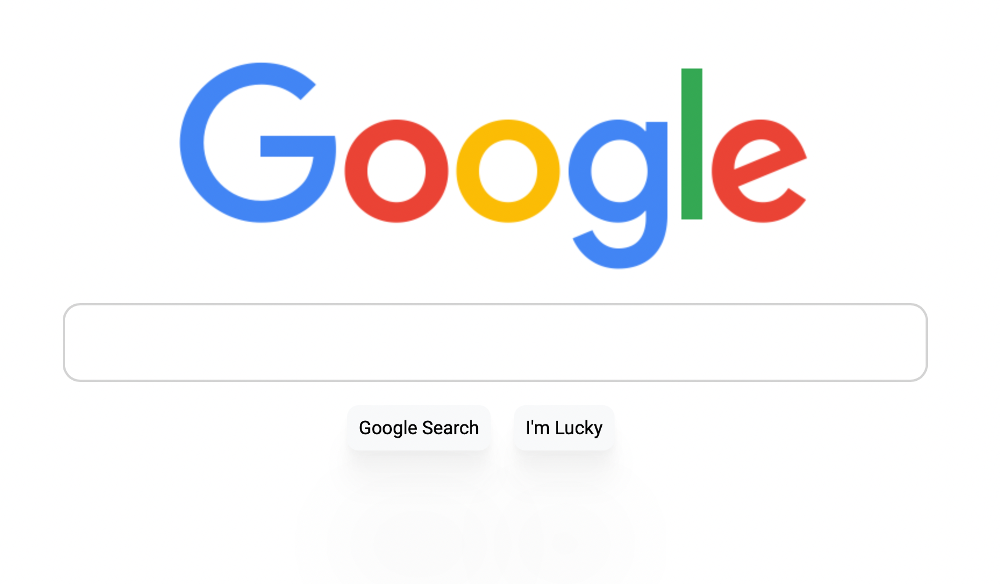

<!-- PROJECT LOGO -->
 

  

  <h3 align="center">🖨 GOOGLE HOME PAGE CLONE 🖨</h3>

  

    <samp>✨A CLONE OF THE FRONT PAGE FOR GOOGLE'S SEARCH ENGINE✨</samp>
      
    
  
  
    

    

## LIVE DEMO
<a href="https://adamdoingtech.github.io/Google-HomePage-V2/" target="_blank">CLICK HERE</a>

 

<!-- BUILD USING -->
## BUILT WITH
* JavaScript.
* HTML.
* CSS.
 
<!-- CONTRIBUTING GUIDELINES -->
<!-- LICENSE -->
## Copyright

Copyright © 2021 [Adam - ATOM LAB X](https://AtomLabX.Dev)

## License

[MIT](https://github.com/AtomLabX/Google-HomePage-V2/blob/main/LICENSE)
